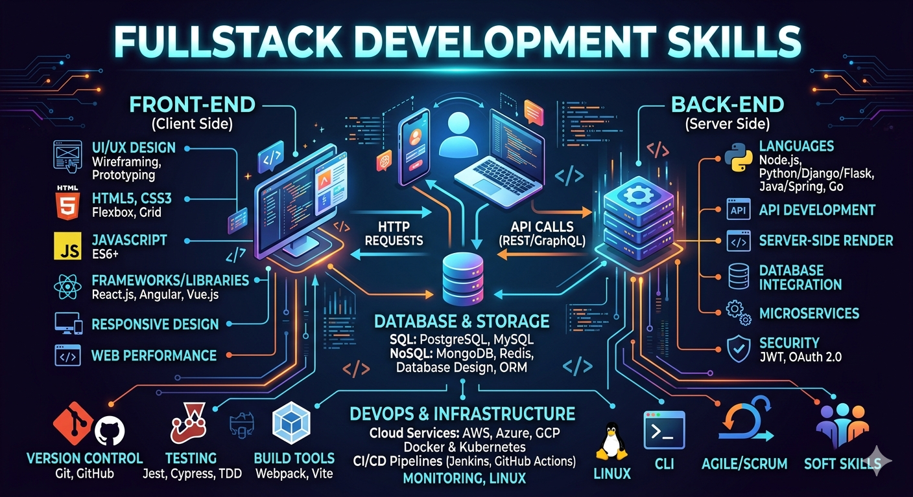

# Fullstack Development Agent Skills

[](LICENSE)
[](#skills-catalog)
[](#skill-packs-by-stack)
[](#platform-presets)
[](#end-to-end-examples)
[](#starter-packs)
[](https://marketplace.visualstudio.com/items?itemName=ViquarKhan.fullstack-development-agent-skills)
[](https://plugins.jetbrains.com/plugin/32167-fullstack-development-agent-skills)

> **🌐 [Project Website](https://vaquarkhan.github.io/Fullstack-development-agent-skills/)** | **📦 [VS Code Marketplace](https://marketplace.visualstudio.com/items?itemName=ViquarKhan.fullstack-development-agent-skills)** | **🔌 [JetBrains Marketplace](https://plugins.jetbrains.com/plugin/32167-fullstack-development-agent-skills)** | **⬇️ [GitHub Releases](https://github.com/vaquarkhan/Fullstack-development-agent-skills/releases/latest)**



Production-grade fullstack development skills for AI agents.

The open skill registry and execution toolkit for fullstack delivery agents.

This repository packages repeatable workflows, quality gates, hooks, installer surfaces, and architecture blueprints so agents can build fullstack applications with the same discipline used by strong engineering teams.

The goal is not to give agents generic prompts. The goal is to give them operating procedures for specifying, planning, implementing, validating, reviewing, and shipping reliable fullstack products.

## Agent Skills Registry Compatibility

This repository is structured to work with open `Agent Skills` registries:

- every capability lives in a directory containing a `SKILL.md`
- every `SKILL.md` starts with YAML frontmatter including at least `name` and `description`
- descriptions are written for progressive disclosure so agents can decide when to load the full skill
- supporting materials live in `references/`, `templates/`, `examples/`, `hooks/`, and `scripts/`

## Quick Start

### Start Here

1. load `skills/using-fullstack-agent-skills/SKILL.md`
2. pick the closest platform preset from `presets/`
3. choose the safest next command from the lifecycle below
4. use one starter pack, template, or example to reduce guessing

### Install Surfaces

#### 📦 Plugin And Release Downloads

> **⬇️ [Install from VS Code Marketplace](https://marketplace.visualstudio.com/items?itemName=ViquarKhan.fullstack-development-agent-skills)** — search "Fullstack Development Agent Skills" in VS Code Extensions panel
>
> **⬇️ [Install from JetBrains Marketplace](https://plugins.jetbrains.com/plugin/32167-fullstack-development-agent-skills)** — IntelliJ, PyCharm, WebStorm, DataGrip, GoLand
>
> **⬇️ [Download VS Code Extension (.vsix)](https://github.com/vaquarkhan/Fullstack-development-agent-skills/releases/latest)** — manual install for VS Code, Cursor, Windsurf, VSCodium
>
> **⬇️ [Download JetBrains Plugin (.zip)](https://github.com/vaquarkhan/Fullstack-development-agent-skills/releases/latest)** — alternative manual download

#### Install By Tool

| Tool or surface | Best starting link | Install path |
| --- | --- | --- |
| `VS Code` | `vscode-extension/README.md` | [Install from Marketplace](https://marketplace.visualstudio.com/items?itemName=ViquarKhan.fullstack-development-agent-skills) or download `.vsix` from Releases |
| `Cursor` | `docs/cursor-setup.md` | use `.cursor/commands/` or `scripts/install.sh cursor` |
| `Claude` | `docs/claude-setup.md` | use `.claude/commands/`, `CLAUDE.md`, or `scripts/install.sh claude` |
| `JetBrains` | `jetbrains-plugin/README.md` | [Install from Marketplace](https://plugins.jetbrains.com/plugin/32167-fullstack-development-agent-skills) or download `.zip` from Releases |
| `Copilot` | `.github/copilot-instructions.md` | use `scripts/install.sh copilot` |
| `Kiro` | `.kiro/steering/` | use `scripts/install.sh kiro` |
| `Windsurf` | `.windsurfrules.example` | use `scripts/install.sh windsurf` |
| `OpenCode` | `.opencode/` | use `scripts/install.sh opencode` |
| `Codex` | `docs/codex-setup.md` | use `AGENTS.md` and `scripts/install.sh codex` |
| generic `AGENTS.md` consumers | `docs/getting-started.md` | use `scripts/install.sh all` |

#### One-Line Script Install

```bash
./scripts/install.sh cursor /path/to/project
./scripts/install.sh claude /path/to/project
./scripts/install.sh kiro /path/to/project
./scripts/install.sh all /path/to/project
```

Windows-friendly install:

```powershell
.\scripts\install.ps1 -Tool cursor -Target C:\path\to\project
.\scripts\install.ps1 -Tool all -Target C:\path\to\project
```

Supported tools: `cursor`, `claude`, `gemini`, `kiro`, `opencode`, `windsurf`, `copilot`, `codex`, `generic`, `all`

## Core Principles

- Spec before code
- Contract-first API and UI state design
- Incremental, release-safe implementation slices
- Quality gates before merge and deploy
- Observability, rollback readiness, and staged rollout by default
- Clear evidence for every change

## Feature Highlights

- Spec-first lifecycle with `/spec`, `/plan`, `/build`, `/validate`, `/review`, `/ship`, `/migrate`, `/harden`, `/incident`, and `/optimize`
- 106 workflow skills (72 core + 34 stack-specific packs) covering UI architecture, backend microservices, identity, edge delivery, cloud infrastructure, testing, observability, payments, and platform operations
- 15 platform presets spanning React, Angular, Vue, Node.js, Java, .NET, AWS, Azure, GCP, Kubernetes, Vercel, and fullstack TypeScript
- 20 starter packs for MVP, SaaS, payments, reliability, microservices, identity/edge, per-cloud serverless, AI features, mobile, chaos/SRE, and GitOps
- Multi-agent packaging for `Cursor`, `Claude`, `Copilot`, `Gemini`, `Codex`, `Kiro`, `OpenCode`, `Windsurf`, and generic `AGENTS.md` consumers
- Plugin delivery for `VS Code` family editors and `JetBrains` IDEs with release downloads and marketplace publishing
- Architecture blueprints with specs, implementation guides, and proof paths
- Structured operational templates, checklists, and reviewer personas

## Feature Coverage

| Area | What is included | Good starting point |
| --- | --- | --- |
| Core delivery workflow | Spec-driven delivery, planning, validation, review, release, and rollback-aware flow | `skills/using-fullstack-agent-skills/SKILL.md` |
| Frontend architecture | React, Next.js, Angular, Vue, Nuxt, design systems, accessibility, CSP, streaming UI, GraphQL, realtime | `presets/react-nextjs-frontend` |
| Backend microservices | Node.js/NestJS, Java Spring Boot, .NET/ASP.NET Core, DDD, saga, outbox, service mesh, CQRS | `presets/nodejs-microservices` |
| Identity and security | OAuth2/OIDC, Okta, AWS Cognito, token lifecycle, secrets management, GDPR compliance | `skills/authentication-and-authorization-fullstack/SKILL.md` |
| Edge and delivery | NGINX, load balancing, CDN, API gateway, global delivery, autoscaling, cost guardrails | `skills/api-gateway-and-edge-security/SKILL.md` |
| Cloud and serverless | AWS, Azure, GCP serverless architectures, Kubernetes, Terraform, Vercel edge | `presets/aws-serverless-fullstack` |
| Data and storage | Zero-downtime migrations, distributed caching, Postgres, Redis, multi-tenant isolation | `skills/database-migrations-zero-downtime/SKILL.md` |
| Testing and quality | Unit, integration, E2E (Playwright/Cypress), contract testing, quality gates | `skills/fullstack-testing-and-quality-gates/SKILL.md` |
| Operations and reliability | Observability, distributed tracing, feature flags, incident triage, chaos engineering, CI/CD | `skills/fullstack-observability-and-release-engineering/SKILL.md` |
| Payments and integration | Webhook reliability, email/notifications, file storage, search, mobile sync | `skills/payments-and-webhook-reliability/SKILL.md` |
| Modernization | Monolith to microservices, distributed monolith detection, domain decomposition | `skills/monolith-to-microservices-migration-strategy/SKILL.md` |
| AI integration | LLM APIs, RAG, embeddings, guardrails for fullstack apps | `skills/ai-llm-integration-in-fullstack-apps/SKILL.md` |

## Lifecycle Commands

These commands are the clearest way to understand the repo. They can be mapped to slash commands, prompts, hooks, or local workflows.

| What you're doing | Command | Key principle |
| --- | --- | --- |
| Define the product | `/spec` | Business outcome, UI states, API contracts, NFRs |
| Plan the work | `/plan` | Small, release-safe, frontend/backend/data slices |
| Build incrementally | `/build` | Contract discipline, compatibility checks |
| Prove quality | `/validate` | Lint, tests, checklists, evidence |
| Review the change | `/review` | Architecture, security, performance, operability |
| Ship safely | `/ship` | Staged rollout, observability, rollback readiness |
| Migrate safely | `/migrate` | Zero-downtime schema, API, platform migrations |
| Harden the system | `/harden` | Security, reliability, performance hardening |
| Handle incidents | `/incident` | Triage, runbooks, postmortems |
| Optimize | `/optimize` | Performance, cost, capacity improvements |

## Choose Your Path

- New fullstack feature → use `/spec`
- React/Next.js project → use `presets/react-nextjs-frontend`
- Node.js microservices → use `presets/nodejs-microservices`
- Java Spring Boot → use `presets/java-spring-boot-microservices`
- .NET backend → use `presets/dotnet-aspnet-core-microservices`
- AWS serverless → use `starter-packs/aws-serverless-fullstack-starter.yaml`
- Azure serverless → use `starter-packs/azure-serverless-fullstack-starter.yaml`
- GCP serverless → use `starter-packs/gcp-serverless-fullstack-starter.yaml`
- SaaS multi-tenant → use `starter-packs/saas-multi-tenant-starter.yaml`
- Payments/billing → use `starter-packs/payments-and-subscriptions-starter.yaml`
- Microservices migration → use `starter-packs/microservices-architecture-modernization-starter.yaml`
- Platform reliability → use `starter-packs/platform-reliability-starter.yaml`
- Identity and edge → use `starter-packs/identity-edge-and-global-delivery-starter.yaml`
- AI features → use `starter-packs/ai-features-starter.yaml`
- Chaos engineering → use `starter-packs/chaos-sre-starter.yaml`
- CI/CD and GitOps → use `starter-packs/gitops-cicd-starter.yaml`

## Hooks

The `hooks/` directory adds a lightweight operating layer:

- `session-start.sh` — Detects repo type, recommends preset and starter pack
- `release-guard.sh` — Validates observability, rollback, reconciliation evidence

Use these hooks when you want the repository to behave more like a workflow system than a static library.

## Skills Catalog

72 core cross-stack skills in `skills/`. See `skills-index.md` for the complete list (106 total with 34 stack packs).

## Skill Packs By Stack

Segregated deep-dive skills in `skill-packs/` — one folder per language/framework:

| Stack | Path | Highlights |
| --- | --- | --- |
| **Java Spring Boot** | `skill-packs/java/spring-boot/` | Enterprise backend, Spring AI, MCP, auto-config (22 skills) |
| **Java Quarkus** | `skill-packs/java/quarkus/` | Kubernetes-native, fast startup, native image |
| **Java Micronaut** | `skill-packs/java/micronaut/` | Compile-time DI, reactive microservices |
| **Java Jakarta EE** | `skill-packs/java/jakarta-ee/` | Standards-based enterprise (regulated industries) |
| **Java Hibernate** | `skill-packs/java/hibernate/` | ORM, fetch tuning, persistence patterns |
| **Java Vaadin** | `skill-packs/java/vaadin/` | Full-stack Java UI without client-side JavaScript |
| **Python FastAPI** | `skill-packs/python/fastapi/` | Async APIs, Pydantic, OpenAPI |
| **Python Django** | `skill-packs/python/django/` | DRF, Celery, enterprise patterns |
| **Go Gin** | `skill-packs/go/gin/` | REST microservices |
| **PHP Laravel** | `skill-packs/php/laravel/` | API platform, Sanctum, queues |
| **Ruby Rails** | `skill-packs/ruby/rails/` | API-only Rails, Sidekiq |

Spring Boot pack includes skills adapted from [spring-boot-skills](https://github.com/rrezartprebreza/spring-boot-skills) (MIT) by @rrezartprebreza.

## Platform Presets

The core skills stay vendor-neutral. Platform-specific guidance lives in presets so agents can adapt the same workflow to the stack a team actually uses.

Current presets:

- `react-nextjs-frontend`
- `fullstack-typescript-monorepo`
- `angular-frontend`
- `vue-nuxt-frontend`
- `nodejs-microservices`
- `java-spring-boot-microservices`
- `dotnet-aspnet-core-microservices`
- `aws-fullstack-development`
- `azure-fullstack-development`
- `gcp-fullstack-development`
- `aws-serverless-fullstack`
- `azure-serverless-fullstack`
- `gcp-serverless-fullstack`
- `kubernetes-fullstack-platform`
- `vercel-nextjs-jamstack`

## Starter Packs

Use the starter packs in `starter-packs/` to adopt the repository by problem area:

- `fullstack-mvp-starter.yaml`
- `enterprise-modernization-starter.yaml`
- `saas-multi-tenant-starter.yaml`
- `payments-and-subscriptions-starter.yaml`
- `platform-reliability-starter.yaml`
- `incident-hardening-and-slo-starter.yaml`
- `microservice-patterns-and-edge-security-starter.yaml`
- `microservices-architecture-modernization-starter.yaml`
- `identity-edge-and-global-delivery-starter.yaml`
- `ui-production-excellence-starter.yaml`
- `aws-serverless-fullstack-starter.yaml`
- `azure-serverless-fullstack-starter.yaml`
- `gcp-serverless-fullstack-starter.yaml`
- `multi-cloud-fullstack-platform-starter.yaml`
- `data-platform-and-events-starter.yaml`
- `compliance-privacy-starter.yaml`
- `ai-features-starter.yaml`
- `mobile-fullstack-starter.yaml`
- `chaos-sre-starter.yaml`
- `gitops-cicd-starter.yaml`

## End-To-End Examples

Architecture blueprints (README-only design packs) are available in `examples/`:

- `react-nextjs-nestjs-monorepo` — Full TypeScript monorepo with shared contracts
- `saas-multi-tenant-bff` — Multi-tenant BFF with tenant isolation and auth flows
- `payments-webhook-platform` — Reliable webhook processing with retries and reconciliation
- `aws-edge-fullstack-delivery` — Lambda@Edge + CloudFront + S3 global delivery
- `aws-lambda-api-cloudfront-spa` — Serverless API + CloudFront SPA distribution
- `azure-apim-functions-static-web-app` — Azure Functions behind APIM with Static Web App
- `gcp-cloud-run-pubsub-nextjs` — Event-driven Cloud Run with Next.js and Pub/Sub
- `java-spring-boot-ai-agent` — Spring Boot + Spring AI + MCP agent platform
- `java-quarkus-kubernetes-native` — Quarkus service on Kubernetes with native profile
- `java-vaadin-fullstack-admin` — Vaadin Flow admin UI on Spring Boot

## Case Studies

- `saas-multi-tenant-platform-launch.md` — End-to-end multi-tenant SaaS delivery
- `payments-subscription-reliability.md` — Webhook processing and billing reliability
- `monolith-to-microservices-cutover.md` — Staged migration with dual-run validation

## Multi-Agent Packaging

Native adapters are included for multiple agent ecosystems:

- `.cursor/commands/`
- `.claude/commands/`
- `.gemini/commands/`
- `.kiro/steering/`
- `.github/copilot-instructions.md`
- `AGENTS.md`
- `CLAUDE.md`
- `.opencode/`
- `.windsurfrules.example`

## Review Agents

Pre-configured specialist personas in `agents/`:

| Agent | Role | Best for |
| --- | --- | --- |
| `frontend-quality-reviewer` | Frontend reviewer | Accessibility, performance, UX consistency, design system compliance |
| `backend-reliability-reviewer` | Reliability reviewer | Circuit breakers, retry storms, data integrity, SLO adherence |
| `security-threat-reviewer` | Security reviewer | OWASP, injection, auth bypass, supply chain, CSP violations |

## VS Code Extension

The VS Code extension lives in `vscode-extension/`.

It provides command-palette installers for:

- the full toolkit
- the core pack
- agent adapters
- starter packs
- MCP templates
- platform presets
- architecture blueprints

Supported editors: `VS Code`, `Cursor`, `Windsurf`, `VSCodium`

## JetBrains Plugin

The plugin source lives in `jetbrains-plugin/`.

**[Install from JetBrains Marketplace](https://plugins.jetbrains.com/plugin/32167-fullstack-development-agent-skills)**

It targets IntelliJ-platform IDEs: `IntelliJ IDEA`, `PyCharm`, `WebStorm`, `DataGrip`, `GoLand`, `Rider`

## MCP Config Templates

Template MCP configs are available in `mcp/` for:

- GitHub
- AWS
- Azure
- GCP

Each template is a starting point. Use `mcp/README.md` for environment-variable requirements before connecting a live system.

## Project Structure

```text
fullstack-development-agent-skills/
├── skills/                    # 72 core cross-stack workflow skills
├── skill-packs/               # 34 stack-specific skills (Java, Python, Go, PHP, Ruby)
├── presets/                   # 15 stack-specific configurations
├── starter-packs/             # 20 opinionated YAML bundles
├── references/                # 16 operational checklists
├── tutorials/                 # 12 guided walkthroughs
├── examples/                  # 10 architecture blueprints (README-only)
├── case-studies/              # 3 delivery scenarios
├── agents/                    # 6 reviewer personas
├── mcp/                       # 8 MCP template configs
├── templates/                 # 3 YAML templates
├── docs/                      # 11 setup and anatomy guides
├── hooks/                     # Session start, release guard
├── scripts/                   # Install scripts (sh + ps1)
├── vscode-extension/          # VS Code extension source
├── jetbrains-plugin/          # JetBrains plugin source
├── registry/assets.json       # Machine-readable index
├── skills-index.md            # Human-readable catalog
├── .cursor/commands/          # Cursor adapter
├── .claude/commands/          # Claude adapter
├── .gemini/commands/          # Gemini adapter
├── .kiro/steering/            # Kiro adapter
├── .opencode/                 # OpenCode adapter
├── .github/copilot-instructions.md  # Copilot adapter
├── AGENTS.md                  # Generic agent adapter
└── CLAUDE.md                  # Claude project doc
```

## Setup Guides

Agent-specific setup guides are available in `docs/`:

- `docs/getting-started.md`
- `docs/cursor-setup.md`
- `docs/claude-setup.md`
- `docs/codex-setup.md`
- `docs/skill-anatomy.md`
- `docs/routing-and-lifecycle.md`
- `docs/plugin-publishing.md`

## Tutorials

Longer-form walkthroughs live in `tutorials/`:

- `tutorials/using-fullstack-agent-skills.md`
- `tutorials/fullstack-architecture-patterns.md`
- `tutorials/microservice-resilience-and-edge-delivery.md`
- `tutorials/identity-oauth-oidc-and-provider-integration.md`
- `tutorials/progressive-release-and-incident-readiness.md`

## Reference Guides

Use `references/` for high-signal checklists:

- `references/fullstack-architecture-review-checklist.md`
- `references/fullstack-auth-security-checklist.md`
- `references/frontend-review-checklist.md`
- `references/frontend-scaling-and-edge-security-checklist.md`
- `references/microservice-patterns-checklist.md`
- `references/microservice-reliability-checklist.md`
- `references/microservices-architecture-patterns-checklist.md`
- `references/cloud-fullstack-readiness-checklist.md`
- `references/cloud-serverless-patterns-checklist.md`
- `references/aws-fullstack-checklist.md`
- `references/azure-fullstack-checklist.md`
- `references/gcp-fullstack-checklist.md`
- `references/identity-edge-and-delivery-checklist.md`
- `references/ui-production-readiness-checklist.md`

## How Skills Work

Each skill lives in its own directory and has a `SKILL.md` entry point.

```text
skills/
  skill-name/
    SKILL.md
```

Each `SKILL.md` includes:

- YAML frontmatter with `name` and `description`
- overview of what the skill does
- clear signals for when to use it
- step-by-step workflow with decision frameworks
- evidence gates and exit criteria
- verification checklist with proof requirements

Key design choices:

- **Workflow, not prose.** Skills guide agent behavior, not just describe concepts.
- **Evidence is required.** Tests, contracts, and rollout proof must exist before ship.
- **Progressive disclosure.** Start with one entry skill, then load minimum useful presets and references.
- **Operational realism.** Observability, rollback, and staged delivery are part of the workflow, not afterthoughts.

## Why Fullstack Agent Skills?

AI agents often default to the shortest path, which is risky in production systems. That usually means:

- skipping specification and contract definition
- treating a successful build as proof of correctness
- ignoring API compatibility, consumer impact, and rollback
- leaving observability, auth, and error handling implicit

This project is opinionated about avoiding those failure modes:

- A feature is not done because the code compiles.
- An API is not production-ready without contracts, tests, and rollback paths.
- A deployment is not safe without observability, staged rollout, and evidence.
- An agent should not guess unclear requirements when the specification can force clarity up front.

## Bootstrap and Validation

```bash
./bootstrap.sh                        # or bootstrap.ps1 on Windows
python scripts/validate-skills.py
python scripts/validate-assets.py
python scripts/sync-registry.py
python scripts/sync-skills-index.py
```

## Contributing

Contributions should be:

- specific
- verifiable
- grounded in real fullstack engineering practice
- compact enough for agents to follow consistently

See `docs/skill-anatomy.md` for required skill structure and quality gates.

## License

MIT

